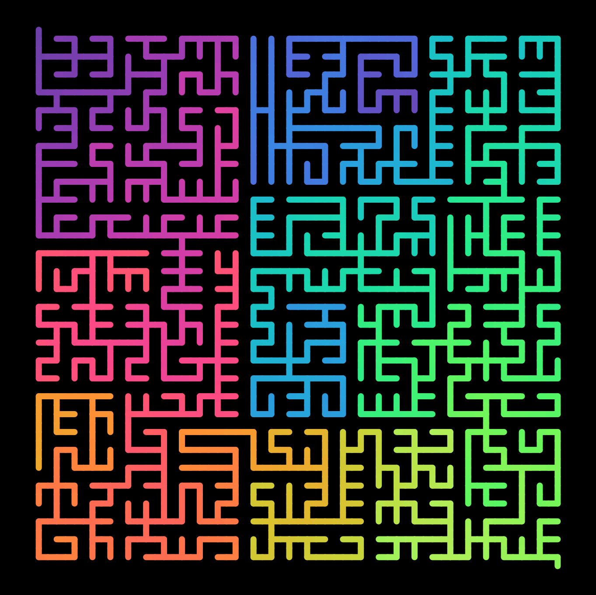
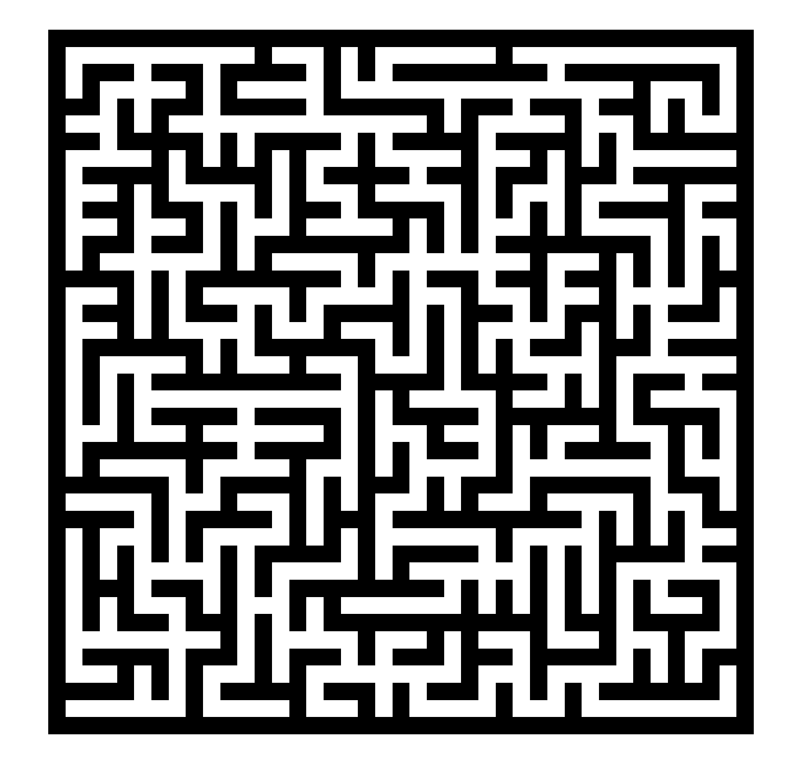
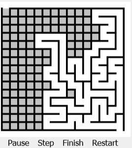

# maze\_generator

**maze\_generator** is a Javascript module for easily generating mazes.



---

⚠️ This module is work-in-progress, so much of it is unstable.

Feedback is welcome. The best way to provide feedback is to open an issue.

---

This module is heavily influenced by [Jamis Buck's Coffeescript mazes](https://github.com/jamis/csmazes). It is structured a little differently though and is written entirely in Javascript rather than Coffeescript. It also functions as a module, rather than a library. I aim to eventually add all the functionality that Jamis's CS maze library has.

## Importing the module

### In the browser and in Deno

If you are inside a Javascript module file or a `type="module"` script tag, then add the following to the top of your code:

```javascript
import {Maze} from "https://x.nest.land/maze_generator@0.1.0/mod.js";
```

If not, you can use the dynamic `import()` function. For example:

```javascript
let Maze;
import("https://x.nest.land/maze_generator@0.1.0/mod.js")
  .then(module => {
    Maze = module.Maze;
  })
  .catch(error => {
    console.log(`Error loading maze_generator module: ${error}`)
  })
```

You can also import the module from `deno.land/x` if you prefer: `https://deno.land/x/maze_generator@v0.1.0/mod.js`.
(Note the `v` here, which is not present when importing from `nest.land`.)

### In Node

Run:

```shell
npm install @thewizardbear/maze_generator
```

And then import the maze_generator module in your code by adding the following to the top of every file that uses it:

```javascript
import {Maze} from "@thewizardbear/maze_generator";
```

Alternately, you can you `require`:

```javascript
let {Maze} = require("@thewizardbear/maze_generator")`
```

Please note that Node version 14+ is required as `maze_generator` makes use of some ES2020 features such as the nullish coalescing operator (`??`).

## Example Usage

```javascript
import {Maze} from "https://x.nest.land/maze_generator@0.1.0/mod.js"

let mazeSettings = {
  width: 12,
  height: 12,
  algorithm: "recursive backtracker"
}

//initialize the maze
let m = Maze.create(mazeSettings);

//generate it
m.generate();

//print the maze to the console
m.printString();
```

## Other examples

See the examples folder for more examples.

Also see [this](https://www.openprocessing.org/sketch/908761) OpenProcessing sketch.

## Maze.create()

To create a new maze, use `Maze.create()`. You can optionally pass in an object with the settings (see below).

### Maze settings object

These are all the properties of the object you can pass in when you write `Maze.create(mazeSettings)`

| Property | Description | Valid Values | Default Value |
|-|-|-|-|
| width (or xSize) | The width of the maze. (How many columns there should be.) | A positive integer. | height or `30` |
| height (or ySize) | The height of the maze. (How many rows there should be.) | A positive integer. | width or `30` |
| algorithm | The algorithm to use. | Any one of the following: `"recursive backtracker"`, `"eller's"`, `"sidewinder"`, `"kruskal's"`, `"simplified prim's"`, `"modified prim's"`, `"true prims"`, `"hunt and kill"`, `"binary tree"`, `"aldous broder"`, `"recursive division"`, `"10 print"`, `"random"` (random algorithm). This isn't case sensitive. Characters other than the letters a-z and digits 0-9 are ignored. | `"recursive backtracker"` (`"prims"` defaults to `"true prims"`) |
| start | Where to start the maze generation from (if there is an option). | An object with both an `x` and `y` property (both integers) or a string referencing a certain point (`"random"` or a certain side or corner such as `"north east"`) | `"random"` for all algorithms except Eller's, binary tree and sidewinder, which are all `{x: 0, y: 0}`. |
| entrance | Where the solution should start from. | An object with both an `x` and `y` property (and an optional `direction` property: `"N"`, `"S"`, `"E"`, or `"W"`) or a string referencing a certain point (`"random"` or a certain side or corner such as `"north east"`) | `"top left"` |
| exit | Where the solution should end. | An object with both an `x` and `y` property (and an optional `direction` property: `"N"`, `"S"`, `"E"`, or `"W"`) or a string referencing a certain point (`"random"` or a certain side or corner such as `"north east"`) | `"bottom right"` |
You can also use the `size` property instead of `width` and `height` to set both dimentions.

## .step()

Call `.step()` to advance the maze one step.

Returns true if the maze hasn't finished generating yet and false if there are no more steps left to take.
You can also check if a maze has finished generating with `.finishedGenerating`, which is a boolean value.

## .generate()

This method calls `.step()` repeatedly until the maze has finished generating (or it has given up).
Returns the finished maze

## .display()

This is the function which displays the maze.

_Note that this function (currently) only works in a html document with a canvas element._

It optionally takes in an object with the properties listed below.

| Property | Description | Valid Values | Default Value |
|-|-|-|-|
| canvas | The canvas to display the maze on. | A canvas element (e.g. `document. getElementsByTagName("canvas")[0]`). | The first canvas element in the html. |
| coloringMode | How the cells are colored. | `"normal"`: regular coloring, `"distance"`: each cell is colored by a distance from a point (WIP). More coloring modes coming soon hopefully. Anything other than the valid values specififed defaults to normal coloring. | `"normal"`  |
| colorScheme | The color scheme to use when `coloringMode` is not `"normal"`. | This can either be `"grayscale"`, `"rainbow"` or an array or hex codes. | `"rainbow"` |
| mainColor | This is the color of the walls (or line). | A hex value as a string | `"#000"` |
| backgroundColor | Background color and color of the space between walls (unless colorMode isn't `"normal"`) | A hex value as a string | `"#FFF"` |
| antiAliasing | Whether or not to apply anti-aliasing to the image drawn on the canvas (`imageSmoothingEnabled`). Setting it to false gives crisp edges but it can distort the output for small canvases where the cells do not line up with the canvas pixels well. | `true` or `false` | `false` |
| showSolution | Whether or not to show the solution when the maze is complete | `true` or `false` | `false` |
| solutionColor | The color of the solution if `showSolution` is `true` | A hex value as a string | `"#F00"` |
| strokeWeight | The thickness of the lines drawn | A number | `4` |
| removeWallsAtEntranceAndExit | Whether or not the walls should be removed at the entrance and exit of the maze. _Note that this doesn't change the maze, it just means these walls won't be displayed._ | A boolean value | `false` |
| lineCap | Changes the [`lineCap` canvas context property](https://developer.mozilla.org/en-US/docs/Web/API/CanvasRenderingContext2D/lineCap). | `"butt"`, `"round"` or `"square"` | `"square"` |

### .display() example usage

```javascript
let kruskalMaze = Maze.create({
  width: 20,
  height: 20,
  algorithm: "Kruskal's"
}).generate();

kruskalMaze.display({
  canvas: document.getElementById("maze-canvas") //Replace this with your canvas element you want to display the maze on.
})
```

This will display a maze similar to this:



## .printString()

Prints out the maze as a string to the console.

### .printString() example usage

#### Basic code

```javascript
Maze.create({
  width: 10,
  height: 10
}).generate().printString()
```

#### Example output

```
 ___________________
|__  _____|   |  __ |
|   | ______|___| __|
| |_|__ |   |_  |__ |
|  _____| |__ | | __|
| |  _____|  _| |_  |
|_  |___  __| |  _| |
| | |   |____ | |  _|
|  _| | |_   ___| | |
| | |_|_  |_|  ____ |
|_______|_____|_____|
```

## Maze.createWidget()

> `Maze.createWidget()` is work-in-progress and particuarly unstable.

Call `Maze.createWidget()` somewhere with access to the `document` API (the browser) and it should add a little interactive animated HTML widget to your page that looks something like this:



It takes in three properties, all optional.

1. Maze settings object (see `Maze.create()`)
2. Display settings object (see `.display()`)
3. Maze widget settings object (see below)

### Maze widget settings object

| Property | Description | Valid Values | Default Value |
|-|-|-|-|
| paused | Whether the generation should be animated when the maze starts. | A boolean value. | `false` |
| imageButtons | Whether the buttons should be images (`true`) or text (`false`). This is still a bit dodgy at the moment. | A boolean value. | `false` |
| containerElement | The element that the maze widget should be placed inside of | A HTML element | An element with the id or class `maze-widget-container`, or if none is found the body of the HTML document. |

### Example code

```html
<div id="prims-demo"></div>
<script>
  import("https://x.nest.land/maze_generator@0.1.0/mod.js")
    .then({Maze} => {
      const mazeSettings = {
        algorithm: "true prims"
      }

      const widgetSettings = {
        paused: true,
        containerElement: document.getElementById("prims-demo")
      }

      Maze.create(mazeSettings, {}, widgetSettings)
    })
    .catch(error => {
      document.getElementById("prims-demo").innerHTML = `Error loading maze_generator module: ${error}`
    })

## .getSolution()

This is a method that returns the solution to the maze in the form of an array of cell positions.

You can optionally pass in a start and end point, but it will default to the top left and bottom right of the maze.

Try `console.log(Maze.create().generate().getSolution())`.
